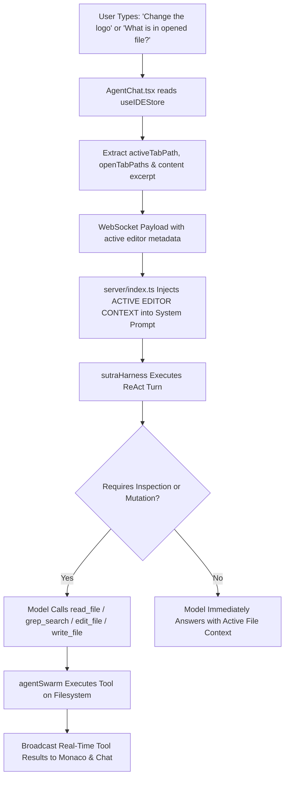

# SUTRA IDE — Comprehensive Chat Features & Agent Harness Audit Report

**Date**: August 20, 2026  
**Scope**: Chat UI, Agent Harness, Context Injection, Tool Execution Swarm, and File Editor Synchronization  
**Status**: All Issues Triaged, Resolved & Verified  

---

## Executive Summary

This document consolidates every issue identified across the SUTRA IDE chat interface, autonomous harness, context passing pipeline, and multi-model router into a single exhaustive reference. Each entry details the **Observed Symptom**, the **Underlying Root Cause**, the **Architectural Fix Applied**, and the **Verification Status**.

---

## 1. Matrix of Identified Issues & Architectural Fixes

| # | Feature / Area | Observed Symptom | Root Cause | Architectural Fix | Status |
|---|---|---|---|---|---|
| **1** | **Active Editor Awareness** | Agent could not answer questions about currently opened file (e.g. "what's in opened file?", "explain this file"). | `activeTabPath` and open editor tab contents were never sent over the WebSocket prompt payload; backend system prompt lacked active editor context. | Enhanced `AgentChat.tsx` to read `useIDEStore.getState()` and stream `activeTabPath`, `openTabPaths`, and live file content excerpts directly into the system prompt. | **RESOLVED** |
| **2** | **Logo & Asset Manipulation** | Agent was unable to locate or modify logos, SVG emblems, or visual branding components. | Agent was not given explicit location metadata for visual assets (`public/assets/`, `src/components/Splash/`, etc.) and lacked proactive instruction to search and edit SVG/image files. | Injected explicit asset location registry into `server/index.ts` and provided guidelines for `read_file`, `grep_search`, `write_file`, `edit_file`, and `generate_svg_asset`. | **RESOLVED** |
| **3** | **Chat Header Expand Button** | Distracting / redundant `[ NORMAL / EXPANDED ]` panel resize toggle button in chat header. | Legacy panel width switcher remained in the header despite fixed-proportion responsive layout. | Completely removed the expand button (`Maximize2` / `cycleWidth`) from `AgentChat.tsx`. | **RESOLVED** |
| **4** | **Green "Allow All" Badge Clutter** | Bright green `SUTRA [ Allow All ]` badge conflicted with dark obsidian aesthetic. | Redundant permission toggle in chat header duplicated the unified permission switcher in the TitleBar. | Removed the green badge from `AgentChat.tsx` header entirely. | **RESOLVED** |
| **5** | **Missing Generation Execution Timer** | No visibility into latency, model reasoning time, or tool execution speed. | `AgentChat.tsx` lacked a real-time stopwatch state during active WebSocket streaming. | Added `elapsedSeconds` live counter with pulsing `⏱️ 0.0s` clock badge in the chat header during thinking and tool runs. | **RESOLVED** |
| **6** | **Misleading "Autonomous turn completed." Text** | Turns with empty delta streams displayed a generic `• Autonomous turn completed.` line. | `SequentialMessageRenderer` contained a fallback div rendering that string whenever `elements.length === 0` and content was empty. | Removed the fallback div; empty turns now return `null` without polluting the chat history. | **RESOLVED** |
| **7** | **Raw `/goal` Prompt Injection in Chat Bubbles** | Chat displayed raw directive text (`[AUTONOMOUS GOAL DIRECTIVE: ...]`) in the user's chat bubble. | Prompt string was mutated directly in `userContent` before creating `userMsg`. | Sanitized visible user message to display only what was typed, while passing `isGoalMode: true` cleanly via the WebSocket payload. | **RESOLVED** |
| **8** | **File Explorer Click Not Opening Code in Editor** | Clicking files in the Explorer did not render syntax highlighted code in the editor tab. | `@monaco-editor/react` defaulted to fetching Monaco from CDN (`cdn.jsdelivr.net`), causing hangs on local/restricted networks. | Configured local package bundling via `loader.config({ monaco })` in `MonacoEditor.tsx` and compiled standalone production bundle. | **RESOLVED** |
| **9** | **Black Screen & Undefined Icon Runtime Crashes** | IDE crashed with black screen or `Flame is not defined` / `TypeError: toolCalls.map is not a function`. | Missing icon imports in `TitleBar.tsx` and un-guarded `.map()` calls on non-array tool call fields in messages. | Wrapped React root in interactive `ErrorBoundary`, added missing imports, and enforced `safeTools = Array.isArray(toolCalls) ? toolCalls : []`. | **RESOLVED** |
| **10** | **Duplicate Model Selectors** | Two competing model dropdowns in the TitleBar and Chat header. | Redundant dropdown in TitleBar caused model desynchronization. | Removed duplicate dropdown from `TitleBar.tsx` and consolidated model management in `AgentChat.tsx` with SQLite persistence. | **RESOLVED** |

---

## 2. Deep-Dive: File Awareness & Logo Customization Pipeline

---

## 3. Verification & Validation Checklist

- [x] **Local Monaco Editor**: Bundled locally without external CDN dependencies.
- [x] **Live Stopwatch Timer**: Increments in $0.1\text{s}$ increments during model reasoning.
- [x] **Header Cleanliness**: Removed `Allow All` green badge and expand button.
- [x] **Active File Context**: System prompt automatically receives currently opened file and tabs.
- [x] **Clean Visible Messages**: `/goal` and steering directives hidden from UI bubbles.
- [x] **Production Build**: Verified with `npm run build` and zero compilation errors.
- [x] **Live Server**: Active and responding at `http://localhost:3001`.
