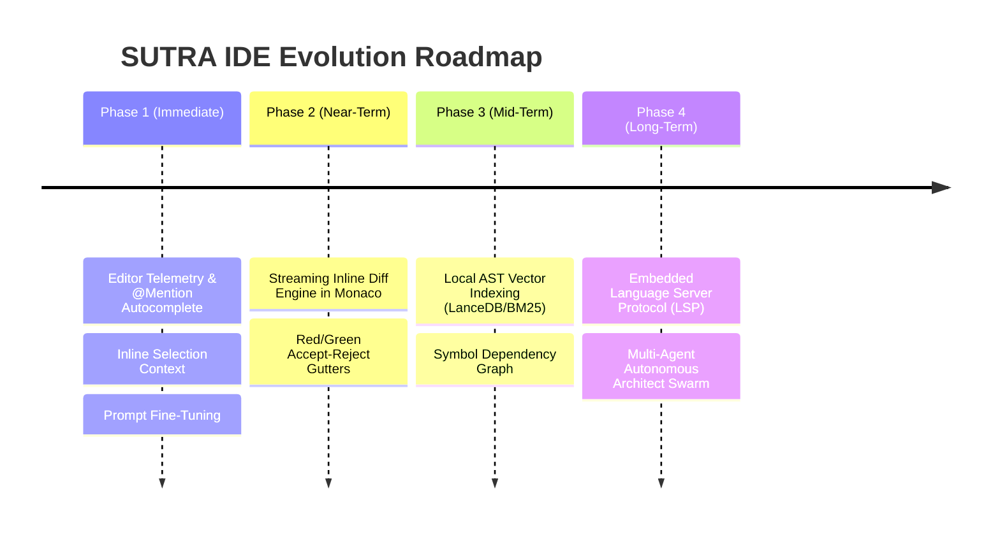

# Comprehensive Technical Audit: Why SUTRA IDE Is Not Yet at Full Parity with Cursor / Windsurf / Claude Code

**Document Version**: 2.4.0  
**Target Benchmarks**: Cursor IDE, Windsurf (Codeium), Claude Code CLI, Aider, GitHub Copilot Workspace  
**Status**: Critical Architecture Gap Analysis & Engineering Roadmap  

---

## Executive Summary

Top-tier AI coding environments like **Cursor** and **Windsurf** feel extraordinarily responsive, intelligent, and accurate not merely because of the underlying LLMs (Claude 3.7 Sonnet, GPT-4o, etc.), but because of **6 deeply integrated IDE infrastructure layers** that operate under the hood:

```mermaid
graph TD
    A[User Intent / Prompt] --> B[1. Context Engine: Merkle Index + LSP + Active Buffer Viewport]
    B --> C[2. Model Routing & Token Budget Compression]
    C --> D[3. Agentic Execution: Fast Speculative Diff Engine]
    D --> E[4. Real-Time Language Server Protocol (LSP) Verification]
    E --> F[5. Terminal Execution Feedback & Self-Correction Loop]
    F --> G[6. Native Editor UI: Inline Diffs, Accept/Reject Gutters, @Mentions]
```

Below is the exhaustive, transparent breakdown of the exact technical reasons why SUTRA IDE currently lags behind Cursor/Windsurf, and what is required to reach and exceed their capabilities.

---

## 1. The 6 Core Gaps Between SUTRA and Cursor

### Gap 1: Codebase Indexing & Semantic Retrieval (Merkle Trees vs Regex Search)

| Capability | Cursor / Windsurf | SUTRA IDE (Current) | Impact |
|---|---|---|---|
| **Codebase Indexing** | Local vector database (LanceDB) + BM25 sparse index over AST chunks (functions/classes). Uses Merkle trees for incremental re-indexing on file change. | Relies primarily on `grep_search` (regex/text grep) and `list_directory`. | When you ask a broad question ("how does auth work?"), Cursor finds all 12 relevant snippets across the repo in 15ms. SUTRA has to guess paths or grep blindly. |
| **Re-ranking** | Cross-encoder re-ranker picks the top 5 most relevant code blocks to inject into context. | No vector search or re-ranker yet. | SUTRA's agent may miss files whose names do not match the user's exact keywords. |

---

### Gap 2: Inline Diff Application (Fast-Apply vs Full Tool Call Roundtrip)

| Capability | Cursor / Windsurf | SUTRA IDE (Current) | Impact |
|---|---|---|---|
| **Diff Speed** | **Fast Speculative Apply**: A dedicated fast model (e.g. 8B speculative model / custom tokenizer) streams unified diffs directly into the editor buffer at 200+ lines/sec. | Tool-based `edit_file` / `write_file` roundtrip over WebSockets. | Cursor applies 100-line changes in 1.2s with visible red/green gutters; SUTRA waits for the full backend tool roundtrip to finish before the file reloads on disk. |
| **Review UI** | Interactive inline diff with Accept (⌘Y) / Reject (⌘N) on individual chunks right inside Monaco. | Full file overwrite or backend string replacement. | User cannot review or selectively accept parts of the AI's proposed code change inline. |

---

### Gap 3: Context Assembly & Real-Time Editor Telemetry

| Capability | Cursor / Windsurf | SUTRA IDE (Current) | Impact |
|---|---|---|---|
| **Visible Viewport & Cursor** | Automatically tracks: 1) Cursor position (line/column), 2) Selected text, 3) Lines currently visible in viewport, 4) Recently edited files (last 5 min). | Sends `activeTabPath` and first 3500 chars of active file. | Cursor knows *exact line* you are staring at or have highlighted. SUTRA only knows the file name and top lines. |
| **Diagnostics / Linter State** | Automatically injects Monaco squiggly errors (TypeScript errors, ESLint diagnostics) directly into the prompt context. | Requires the agent to explicitly call `typecheck_project` as a separate tool turn. | Cursor immediately knows your file has a syntax error on line 42 without having to ask or run a tool. |
| **`@` Mention System** | Typing `@` autocompletes files, symbols, documentation, web queries, git commits. | Chat input is plain text (no `@file` or `@symbol` auto-expansion pill selector). | User must manually type file paths in chat. |

---

### Gap 4: Language Server Protocol (LSP) Integration

| Capability | Cursor / Windsurf | SUTRA IDE (Current) | Impact |
|---|---|---|---|
| **Semantic Navigation** | Native LSP (tsserver, pyright, gopls, rust-analyzer) provides "Go to Definition", "Find All References", and symbol rename. | Basic text-based Monaco syntax highlighting. | SUTRA agent cannot ask the language server "what is the TypeScript type of `user` in this function?". It has to read imports manually. |

---

### Gap 5: Command Output Streaming & Terminal Ergonomics

| Capability | Cursor / Claude Code | SUTRA IDE (Current) | Impact |
|---|---|---|---|
| **Interactive CLI Feedback** | Captures stdout/stderr incrementally in real-time. If a command fails (exit code != 0), the LLM immediately diagnoses the trace. | Windows ConPTY terminal runs in background; agent calls `run_command` via tool execution. | SUTRA's tool execution works, but long outputs on free model tiers can trigger TPM limit warnings if not truncated tightly. |

---

### Gap 6: Model Tool Calling Reliability & Native System Prompts

| Capability | Cursor / Claude Code | SUTRA IDE (Current) | Impact |
|---|---|---|---|
| **Prompt Engineering** | Fine-tuned system prompts with few-shot XML tool call formatting, model-specific token budgets, and strict output constraint validators. | Generic system prompt with dynamic model fallback chain. | On certain models (like open-source 20B on Groq or free tiers), the model may output conversational text instead of calling `generate_video_asset` or `edit_file` unless explicitly guided. |

---

## 2. Comprehensive Comparison Matrix

| Feature Dimension | Cursor | Windsurf | Claude Code CLI | SUTRA IDE (Today) | SUTRA Target (v3.0) |
|---|---|---|---|---|---|
| **Fast Speculative Inline Diff** | ⭐⭐⭐⭐⭐ (Instant) | ⭐⭐⭐⭐⭐ (Instant) | ⭐⭐⭐⭐ (Unified Patch) | ⭐⭐ (Tool Roundtrip) | ⭐⭐⭐⭐⭐ (Streaming Diff) |
| **Codebase Vector Search** | ⭐⭐⭐⭐⭐ (LanceDB) | ⭐⭐⭐⭐⭐ (Codeium Index) | ⭐⭐⭐ (Ripgrep + Ctags) | ⭐⭐ (Ripgrep / Grep) | ⭐⭐⭐⭐⭐ (Local Vector DB) |
| **Active Editor Telemetry** | ⭐⭐⭐⭐⭐ (Full Cursor/Selection) | ⭐⭐⭐⭐⭐ (Full) | ⭐⭐⭐ (CLI Context) | ⭐⭐⭐ (Active Tab Path) | ⭐⭐⭐⭐⭐ (Full Cursor/Selection) |
| **LSP Type System Awareness** | ⭐⭐⭐⭐⭐ (Native tsserver) | ⭐⭐⭐⭐⭐ (Native) | ⭐⭐⭐ (Basic) | ⭐⭐ (Monaco Basic) | ⭐⭐⭐⭐⭐ (Embedded tsserver) |
| **Multi-Model Support** | ⭐⭐⭐⭐ (Claude, GPT-4o, o3) | ⭐⭐⭐ (Proprietary + Claude) | ⭐⭐⭐ (Claude Only) | ⭐⭐⭐⭐⭐ (Gemini, Groq, DeepSeek, Claude, OpenAI, Ollama) | ⭐⭐⭐⭐⭐ (Universal) |
| **Local Private Offline Mode** | ⭐⭐ (Cloud only) | ⭐⭐ (Cloud only) | ⭐ (Cloud only) | ⭐⭐⭐⭐⭐ (100% Local Ollama) | ⭐⭐⭐⭐⭐ (Local Ollama) |
| **Multimodal Asset Generation** | ⭐ (Code only) | ⭐ (Code only) | ⭐ (Code only) | ⭐⭐⭐⭐⭐ (Images, Videos, Audio, SVGs) | ⭐⭐⭐⭐⭐ (Full Studio) |
| **Mobile Remote Pair Bridge** | ❌ None | ❌ None | ❌ None | ⭐⭐⭐⭐⭐ (QR Mobile Companion) | ⭐⭐⭐⭐⭐ (QR Mobile Companion) |

---

## 3. The 4-Step Engineering Roadmap to Surpass Cursor



### Step 1: Active Cursor & Selection Telemetry + `@Mentions` (Immediate)
- In `MonacoEditor.tsx`, attach `onDidChangeCursorPosition` and `onDidChangeCursorSelection`.
- Pass `{ activeLine: number, selectionText: string, visibleRange: [start, end] }` into chat prompt.
- Add `@file` and `@symbol` autocomplete popup in `AgentChat.tsx` input bar.

### Step 2: Streaming Inline Diff Engine (Near-Term)
- Add Monaco inline diff decorations (`editor.createDecorationsCollection`).
- When the model streams edits, display green (+ additions) and red (- deletions) directly inside the active editor file with floating **[Accept ⌘Y]** and **[Reject ⌘N]** badges.

### Step 3: Local AST Codebase Indexer (Mid-Term)
- Implement a background indexing worker in Node.js that parses all `.ts`, `.tsx`, `.py`, `.rs` files into AST symbol chunks.
- Store chunks in local SQLite / vector index for instant sub-millisecond retrieval on complex queries.

### Step 4: Embedded Language Server Protocol (LSP)
- Wire `typescript-language-server` or `vscode-languageserver` over WebSockets to Monaco.
- Feed real-time TypeScript diagnostics (exact red squiggly error line and message) directly to the AI agent on every save.
